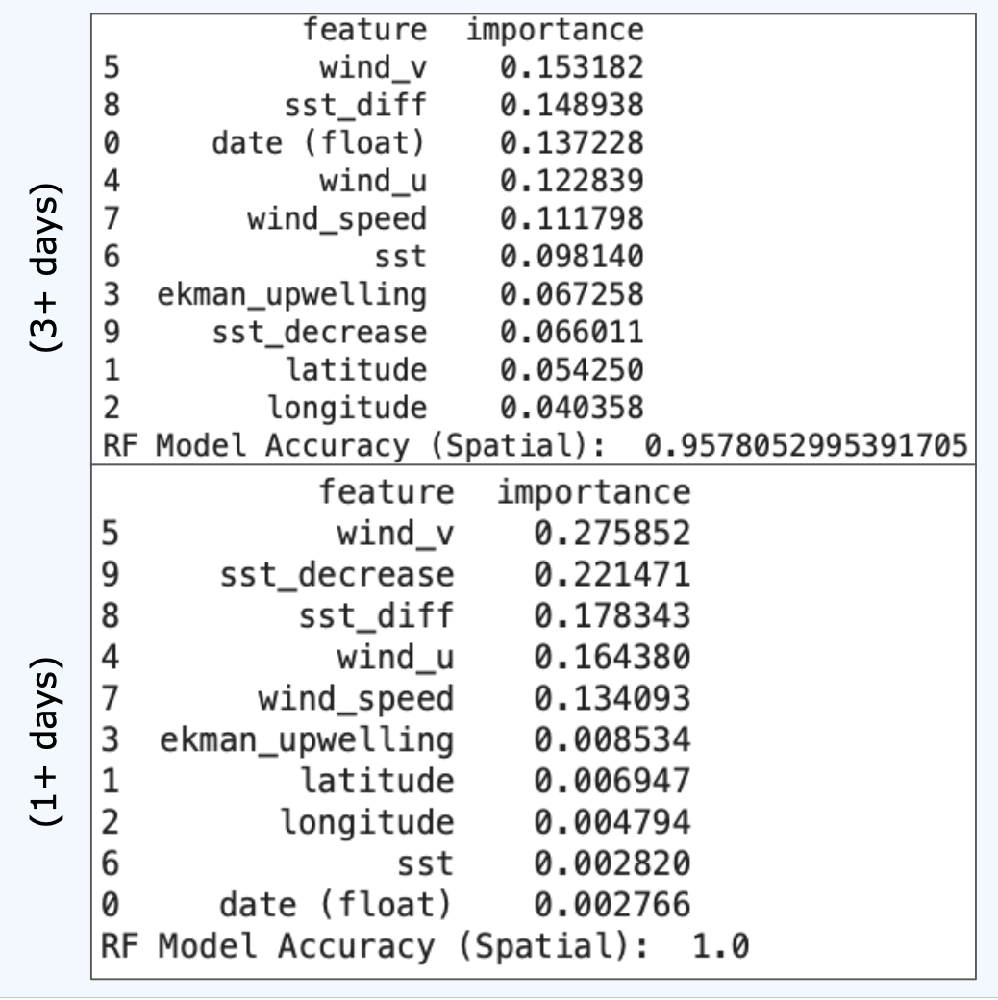

# California Current System: Upwelling Predictions

# Background
##### Increased carbon dioxide emissions has caused global atmospheric temperatures to rise, which has led to various climatic shifts. Some of these shifts include changes in weather patterns and rising sea-surface temperatures and are expected to get worse (Fig. 1). It is also expected that upwelling will increase in the future, which can result in more primary productivity due to upwelling bringing cold nutrient-rich waters to the surface (Fig. 2) [2, 3]. However, this primary productivity can result in algal blooms that can potentially become hazardous to local communities and marine life (Fig. 3) [4]. Understanding the impacts of potential increased algal bloom frequency is important to fishing communities and commercial fisheries since they can impact the overall health of the ecosystem [1].

###### Figure 1: Projected annual carbon emissions and projected global atmospheric temperatures. Highlights how atmospheric temperatures are expected to continue to increase, indicating potential further shifts in climatic feedback. image source [7]

###### Figure 2: Areas of coastal upwelling zones. image source [5]

###### Figure 3: Diagram briefly showcasing how upwelling occurs and how it influences primary productivity leading to algal blooms. image source [3]

# Data
##### From NOAA’s Coastwatch ERDDAP system, two datasets were downloaded:
    Timeframe and Coordinate Box Dimensions
        09-03-2021 to 04-01-2025 (Wind)
        09-03-2021 to 03-29-2025 (SST)
        35º N to 40º N, -125º W to -123º W
            California Current System
##### Wind (time, lat, lon, u_wind, v_wind, ekman_upwelling)
###### File that was downloaded ([link](https://coastwatch.pfeg.noaa.gov/erddap/griddap/erdQCwindproducts1day.html?wind_u%5B(2025-04-09T12:00:00Z)%5D%5B(10.0)%5D%5B(44.500045):(32.166724)%5D%5B(-131.166715):(-118.833394)%5D,wind_v%5B(2025-04-09T12:00:00Z)%5D%5B(10.0)%5D%5B(44.500045):(32.166724)%5D%5B(-131.166715):(-118.833394)%5D&.draw=vectors&.vars=longitude%7Clatitude%7Cwind_u%7Cwind_v&.color=0x000000&.bgColor=0xffccccff)): [windproducts.csv](https://github.com/racdurr/upwellingpredictions/blob/main/DownloadedDataFiles/windproducts.csv)
##### Sea-Surface Temperature (time, lat, lon, sst)
###### File that was downloaded ([link](https://coastwatch.pfeg.noaa.gov/erddap/griddap/ncdcOisst21Agg_LonPM180.html )): [sst.csv](https://github.com/racdurr/upwellingpredictions/blob/main/DownloadedDataFiles/sst.csv)

# Methods
##### Interpolation Method: Spline Interpolation
###### Why? Spline can handle the type of data while smoothing. Kriging could work, but most importantly, SST and wind see a gradual change with longitude and latitude unlike things like topography
##### Machine Learning Method: Random Forest and Neural Network
##### Extra: Logistic Regression + Plots

## Parameters Used
##### Upwelling occurs when there are strong offshore winds and for the California Current System, those are northerly/northwesterly/equatorward winds and events are typically 1-2 weeks [3]. For CCS, it also causes cold nutrient-rich bottom waters to be brought to the surface, hence we can use sea-surface temperatures and chlorophyll-a data. Unfortunately, chl-a datasets were too large for download (2019 MacBook Pro was used) and when a .csv file was downloadable, it was on a much shorter time scale than wind and SST datasets, as well as still too computationally heavy. 

##### Parameters are based on what is known to cause upwelling in the CCS as well as Barrow Canyon, AK to help refine the upwelling definition in the code (DatasetPreparation.ipynb). Upwelling in Barrow occurs when winds are greater than 4 m/s, last for more than 12 hours and are easterly winds, strong upwelling events occur with >10 m/s that last for 4 or more days [8]. Together, upwelling was defined using positive u wind (meridional, west-east (x) direction), negative v wind (zonal, north-south (y) direction), wind speed > 5 m/s and if SST decreased. U and v wind were defined based on that positive u wind met wind from the west, and negative v wind indicating winds from the north (Fig. 4). 

##### These parameters were defined on a 1+ and 3+ day scale. 1+ day will overestimate the true number of actual upwelling events occurring, while 3+ day scale will likely overestimate but not as much as the 1+ day. This was also not to limit events that are longer than 14 days as with upwelling there are lag responses. Meaning that non-favorable upwelling winds will need to persist almost as long as what would result in upwelling, but if they were to reverse back to favorable upwelling winds in less than 6 hours, upwelling could still persist.

###### Relative parameter used in code: 
######     (u_wind > 0 and v_wind < 0 and wind_speed > 5 and SST_decrease == True)

###### Note: did not use ekman_upwelling data in defining parameters but can still be used - upwelling is occurring when ekman_upwelling > 0, otherwise downwelling is occurring (ekman_upwelling < 0) [1]

###### Figure 4: Zonal (v in y direction) vs Meridonal (u in x direction) wind, how to define northwesterly/eqautorward winds for the upwelling parameter [6]

## Dataset Preparation Code
##### [DatasetPreparation.ipynb](https://github.com/racdurr/upwellingpredictions/blob/main/Code/DatasetPreparation.ipynb)
##### Datasets Created: [wind_sst.csv](https://github.com/racdurr/upwellingpredictions/blob/main/CodeGeneratedDataFiles/wind_sst.csv), [upwelling_spatial.csv](https://github.com/racdurr/upwellingpredictions/blob/main/CodeGeneratedDataFiles/upwelling_spatial.csv) and [upwelling_nonspatial.csv](https://github.com/racdurr/upwellingpredictions/blob/main/CodeGeneratedDataFiles/upwelling_nonspatial.csv)

##### This juppyter notebook includes several aspects and is grouped by:
###### 1. Uploading Wind Dataset + Spline Interpolation
###### 2. Uploading SST Dataset + Spline Interpolation
###### 3. Merging the two Interpolated Datasets
###### 4. Defining Upwelling (Spatially and Non-Spatially) - this is where sst_decrease, upwelling1day and upwelling3day columns are created, as well as where upwelling_spatial and upwelling_nonspatial csv files are generated

## Upwelling Predictions Code
##### [UpwellingPredictions.ipynb](https://github.com/racdurr/upwellingpredictions/blob/main/Code/UpwellingPredictions.ipynb)
##### This juppyter notebook includes several aspects and is grouped by:
###### 1. Random Forest and Neural Network with Spatial Data
###### 2. Random Forest and Neural Network with Non-Spatial Data 
###### 3. Summary of Results for both ML Methods and Spatial and Non-Spatial Data

## Logistic Regression Code
##### [Logistic_CorrelationPlot.ipynb](https://github.com/racdurr/upwellingpredictions/blob/main/Code/Logistic_CorrelationPlot.ipynb)
##### This juppyter notebook includes several aspects and is grouped by:
###### 1. Logistic Regression with Correlation Matrix for Spatial Data
###### 2. Logistic Regression with Correlation Matrix for Non-Spatial Data

## Visual Representation Code
##### [ImageAnalysis.ipynb](https://github.com/racdurr/upwellingpredictions/blob/main/Code/ImageAnalysis.ipynb)
###### Timeseries plot showcasing the occurrence of upwelling over 3 or more days against sea-surface temperatures

# Results and Summary
### Random Forest
##### Results between spatial and non-spatial datasets in the random forest, slightly vary. From the spatial dataset, accuracy improves when upwelling occurs for when parameters are met for one or more days, potentially indicating overestimation (Fig.5). Similarly, non-spatial dataset also sees an improved accuracy when parameters are met for one or more days (Fig. 6). Wind in the North-South direction (wind_v) showcases to be the most important feature between all datasets and each parameter, from there it differs if sst or u_wind (West-East) is the next more important feature (Fig. 5 and 6)

###### Figure 5: Results of Random Forest on Saptial dataset, showcasing for when both 1+ or 3+ days have passed. 

###### Figure 6: Results of Random Forest on Non-Saptial dataset, showcasing for when both 1+ or 3+ days have passed. 

### Neural Network:
##### Only one neural network was able to work properly after several attempts to get one to work for each dataset and parameter. Of these four, only non-spatial and one or more days of upwelling paramenets being met, showcases results (Fig. 8). This neural network, just like the others, still needs some work, as the FalsePositives are extremely high, but the TruePositives is valid as we do expect more non-upwelling events to be predicted than upwelling. Another interesting thing to note, is that between spatial and non-spatial dataset, the 3+ days accuracy is better in the spatial dataset, while 1+ days from the non-spatial dataset is better (Fig. 7 and Fig. 8). This brings into question if the neural network can determine that the spatial, 1 or more days of upwelling, is overestimating.

###### Figure 7: Results of Neural Network on Saptial dataset, showcasing for when both 1+ or 3+ days have passed. 

###### Figure 8: Results of Neural Network on Non-Saptial dataset, showcasing for when both 1+ or 3+ days have passed. 

### Logistic Regression
##### Logistic regression was utilized due to the issues encountered with the neural network, and primarily focuses on the 3+ days data set, since neither datasets, spatially or non-spatially, were able to generate an accurate model. Results for both days are similar but slightly differ in that the non-spatial sees a higher TruePositive and FalseNegatives (Fig. 9 and Fig. 10). What's interesting to note is that the FalsePositives for both datasets are still extremely high and indicates that there are more times where upwelling is said to have happened but actually didn't.

###### Figure 9: Results of Neural Network on Saptial dataset, only showcasing for when 3+ days have passed. 

###### Figure 10: Results of Neural Network on Non-Saptial dataset, only showcasing for when 3+ days have passed

## Visual Representation
##### When plotting 3 or more days of upwelling parameters being met against sea-surface temperatures, it can be noted that a decline in sst follows (Fig. 11). This is important to note as this does verify that the definition applied to the upwelling parameter is at least accurate in terms of sst responses, showcasing sst decreasing is a result of upwelling occurrence.

###### Figure 11: The occurrence of upwelling occurring for three or more days plotted against sea-surface temperatures to check for the expected trend of sst decreasing as upwelling occurs.

## Comments
##### In general, a neural network may not be a good fit for predicting upwelling events but random forests and logistic regressions at least showcase potential. I believe refining the parameters could help, as well as bringing more data and potentially chlorophyll-a concentrations or nutrients to bring another response indicator to determine if upwelling is occurring. However, chl-a data can be either limited or computationally heavy due to high resolution, while nutrient data is relatively hard to come by and tends to not have the spatial coverage like sst and wind data.

# Notes 
##### 1. A 2019 MacBook Pro was used (took up about 30 GB of computer storage)
##### 2. All code was done in Jupyter Lab (through Anaconda extension)
##### 3. Data is very computationally heavy, recommend a computer with more RAM than what was used
##### 4. Neural Network may showcase a potential dataset processing error

# Rerefences

##### [1] Bograd, S. J., Schroeder, I., Sarkar, N., Qiu, X., Sydeman, W. J., & Schwing, F. B. (2009). Phenology of Coastal Upwelling in the California Current. Geophysical Research Letter, 36(1). https://doi.org/10.1029/2008GL035933.

##### [2] Ding, H., Alexander, M. A., & Jacox, M. G. (2021). Role of Geostrophic Currents in Future Changes of Coastal Upwelling in the California Current System. Geophysical Research Letters, 48(3). https://doi-org.lp.hscl.ufl.edu/10.1029/2020GL090768.

##### [3] Northwest Fisheries Science Center. (2024). Oceanography of the Northern California Current Study Area. NOAA Fisheries. www.fisheries.noaa.gov/west-coast/science-data/oceanography-northern-california-current-study-area#:~:text=Coastal%20Upwelling,-Coastal%20upwelling%20is&text=Upwelling%20can%20occur%20year%2Dround,(Figure%20CU%2D01).

##### [4] Townhill, B. L., Tinker, J., Jones, M., Pitois, S., Creach, V., Simpson, S. D., Dye, S., Bear, E., & Pinnegar, J. K. (2018). Harmful Algal Blooms and Climate Change: Exploring Future Distribution Changes. ICES Journal of Marine Sciences, 75(6), pp. 1882-1893. https://doi.org/10.1093/icesjms/fsy113.

##### [5] Upwelling. National Ocean Service (NOAA). https://oceanservice.noaa.gov/education/tutorial_currents/03coastal4.html

##### [6] Ichsana, D. (2023). Meteorology 101: How to Plot Wind Map. Medium. https://dwikita-ichsana.medium.com/meteorology-101-how-to-plot-wind-map-e43c196edce8

##### [7] Lindsey, R., & Dahlman, L. (2024). Climate Change: Global Temperature. NOAA Climate. www.climate.gov/news-features/understanding-climate/climate-change-global-temperature

##### [8] Pickart, R. S., Schulze, L. M., Moore, G. W. K., Charette, M. A., Arrigo, K. R., Dijken, G. V., Danielson, S. L. (2013). Long-term Trends of Upwelling and Impacts on Primary Productivity in the Alaskan Beaufort Sea. Deep Sea Research Part I: Oceanographic Research Papers, 79, pp. 106-121. https://doi.org/10.1016/j.dsr.2013.05.003.
